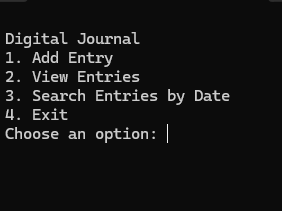

# Digital Journal

**Digital Journal** is a simple Python command-line application that allows you to create, view, and search journal entries by date. It’s perfect for keeping track of your thoughts and memories in a lightweight, text-based format. Easy to set up and use!


## Installation

```bash
# OS X & Linux
1. Clone the repository.
2. Make sure you have Python 3.x installed.
3. Run `journal.py` using the command:

# Windows
1. Clone the repository.
2. Make sure you have Python 3.x installed.
3. Run `journal.py` using the command:

# General Installation Command
python journal.py
```

## Usage

Add Entry: Add a new journal entry.
View Entries: View all saved journal entries.
Search Entries by Date: Search for entries on a specific date.
Exit: Exit the program.

```javascript

```

## Tech Stack
Python 3.x

## Deployment
```bash
python journal.py
```

## Used By
6a6y Studios LLC, Personal use

## Running Tests
```bash
python -m unittest discover
```

## Screenshots


## License
MIT

## Author
- 6a6y Studios LLC [GitHub](https://github.com/6a6yStudios)